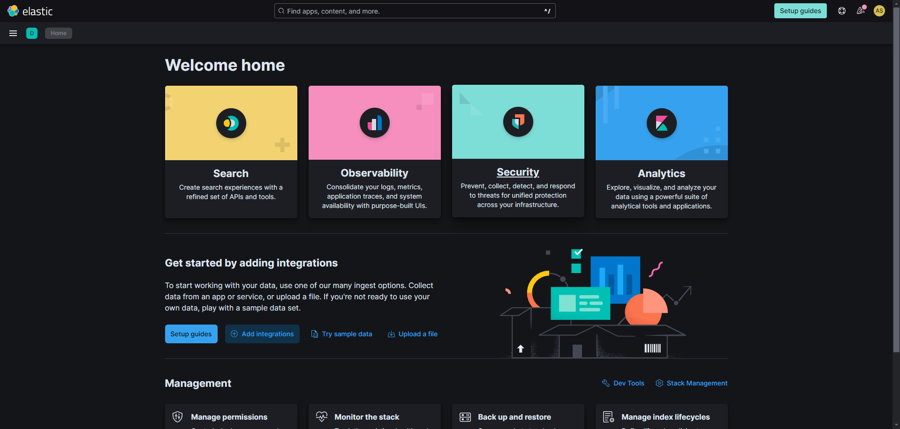
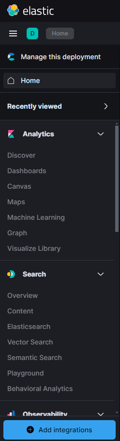

# Simple SIEM Lab
<h2>Objectives</h2>

- <b>Generate security events on the Kali VM</b>
- <b>Configure and set up an agent to forward data from the Kali VM to the SIEM</b>
- <b>Query and analyze the forwarded logs in the Elastic SIEM</b>
 

<h2>Requirements</h2>

- <b>Oracle VirtualBox</b> : https://www.virtualbox.org/wiki/Downloads
- <b>Elastic Cloud</b>     : https://cloud.elastic.co/registration
- <b>Kali</b>              : https://www.kali.org/get-kali/#kali-virtual-machines.
- <b>Basic Knowledge of Linux</b>
 

<h2>Steps to follow</h2>

  
- <b>Set up a free Elastic account and Install the Kali VM.</b>

- <b>Configure the Elastic Agent on the Linux VM to collect the logs and forward it to the SIEM.</b>

- <b>Generate security events on the Kali VM.</b>

- <b>Query to find the security events in the Elastic SIEM.</b>

- <b>Create a Dashboard to visualize security events.</b>

- <b>Create alerts for security events.</b>
 

<h2>Implementation</h2>

1. <b>Setting up a free Elastic account and Install the Kali VM:</b>

      - <b>Free Trial Elastic account: </b>Use Elastic Cloud registration link from above to sign up for a free trial account. Then log in to the Elastic Cloud console, click on the “Start your free trial”.
      Click on the “Create Deployment” button and select “Elasticsearch” as the deployment type. Choose a region and deployment size according to your needs and click on the “Create Deployment”.
      Wait for the configuration to complete. Once the deployment is ready, click “Continue”.

      - <b>Free Elastic account setup and created Deployment: </b>

        
            

      - <b>Kali VM installed: </b>
            Go to the links provided above, download and install Oracle Virtual Box, then download Kali Linux VM and save it in a folder on the computer. Virtual box will be used to setup and run a virtual machine and Kali Linux VM will be installed on the virtual machine.
            Once the installation is completed, log in to the Kali VM using the credentials <b>“kali”</b> for both the username and password.

        
             
             
 

2. <b>Setting up the Agent to Collect Logs:</b> We must set up an agent to efficiently monitor security events on your Kali virtual machine and make sure they are transmitted to your Elastic SIEM instance. When it comes to gathering and sending data from devices to a centralised system for monitoring and analysis, agents are essential. To configure the agent to gather logs from your Kali virtual machine and send them to your Elastic SIEM instance, follow these steps:
      - Go to the Integrations page after logging into your Elastic SIEM instance. 
      - This can be accomplished by selecting "Integrations" at the bottom after clicking on the Kibana main menu bar in the upper left corner. 

      

      
      

Search for "Elastic Defend" and click on it to open the integration page.
      
