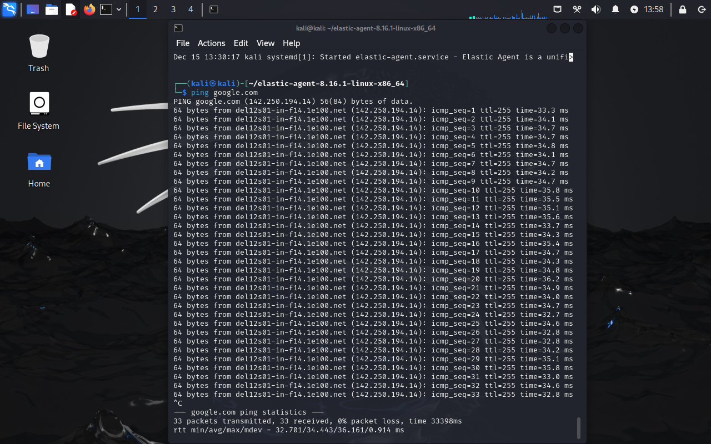

# Simple SIEM Lab
<h2>Objectives</h2>

- <b>Generate security events on the Kali VM</b>
- <b>Configure and set up an agent to forward data from the Kali VM to the SIEM</b>
- <b>Query and analyze the forwarded logs in the Elastic SIEM</b>
 

<h2>Requirements</h2>

- <b>Oracle VirtualBox</b> : https://www.virtualbox.org/wiki/Downloads
- <b>Elastic Cloud</b>     : https://cloud.elastic.co/registration
- <b>Kali</b>              : https://www.kali.org/get-kali/#kali-virtual-machines.
- <b>Basic Knowledge of Linux</b>
 

<h2>Steps to follow</h2>

  
- <b>Set up a free Elastic account and Install the Kali VM.</b>

- <b>Configure the Elastic Agent on the Linux VM to collect the logs and forward it to the SIEM.</b>

- <b>Generate security events on the Kali VM.</b>

- <b>Query to find the security events in the Elastic SIEM.</b>

- <b>Create a Dashboard to visualize security events.</b>

- <b>Create alerts for security events.</b>
 

<h2>Implementation</h2>

1. <b>Setting up a free Elastic account and Install the Kali VM:</b>

      - <b>Free Trial Elastic account: </b>Use Elastic Cloud registration link from above to sign up for a free trial account. Then log in to the Elastic Cloud console, click on the “Start your free trial”.
      Click on the “Create Deployment” button and select “Elasticsearch” as the deployment type. Choose a region and deployment size according to your needs and click on the “Create Deployment”.
      Wait for the configuration to complete. Once the deployment is ready, click “Continue”.

      - <b>Free Elastic account setup and created Deployment: </b>

        
            

      - <b>Kali VM installed: </b>
            Go to the links provided above, download and install Oracle Virtual Box, then download Kali Linux VM and save it in a folder on the computer. Virtual box will be used to setup and run a virtual machine and Kali Linux VM will be installed on the virtual machine.
            Once the installation is completed, log in to the Kali VM using the credentials <b>“kali”</b> for both the username and password.

        
             
             
 

2. <b>Setting up the Agent to Collect Logs:</b> We must set up an agent to efficiently monitor security events on your Kali virtual machine and make sure they are transmitted to your Elastic SIEM instance. When it comes to gathering and sending data from devices to a centralised system for monitoring and analysis, agents are essential. To configure the agent to gather logs from your Kali virtual machine and send them to your Elastic SIEM instance, follow these steps:
      - Go to the Integrations page after logging into your Elastic SIEM instance. 
      - This can be accomplished by selecting "Integrations" at the bottom after clicking on the Kibana main menu bar in the upper left corner. 

      

      
      
  

     - Search for "Elastic Defend" and click on it to open the integration page.

       

     - Then add the "Elastic Defend" Integration.

          

       

     - Next, click on "Install Elastic Defend" and carefully follow the instructions provided on the integration page to install the agent on your Kali VM. Make sure to select "Linux" and copy the provided command to your clipboard.

         

     - Paste the copied command into the terminal of your Kali VM. 

         

       Once the installation process is complete, which may take a few minutes, you'll receive a confirmation message stating "Elastic Agent has been successfully installed." The agent will automatically start collecting and forwarding logs to your Elastic SIEM instance. However, it might take a few minutes for the logs to appear in the SIEM.

       To verify that the agent has been installed correctly, run the following command in your Kali terminal: <b>sudo systemctl status elastic-agent.service</b>

        
         

       If you get any error installing the agent, make sure that your Kali is connected to the internet before proceeding by pinging google.com

          

       - Let's create a few security-related events on your Kali virtual machine to make sure the agent is operating correctly. We'll make use of a potent tool called Nmap for this. Network Mapper, or Nmap for short, is a priceless open-source tool that is well-known for network administration, security audits, and exploration. It is designed to efficiently map out a computer network's infrastructure by exposing hosts and services. Nmap is excellent at determining operating systems and software versions, searching hosts for open ports, and obtaining thorough network knowledge. Follow these simple steps to conduct an Nmap scan:

       - <b>(Optional) Install Nmap:</b> If you're not using Kali Linux (where Nmap comes preinstalled), you'll need to install it on your Linux VM. Open a new Terminal and execute the following command to install Nmap: <b>sudo apt install nmap</b>
       
       - <b>Run the Scan:</b> With Nmap installed, initiate a scan on your Kali machine. Execute this command in the Terminal: <b>nmap -sC -sV -p- localhost</b>
      
       
         

       - Run a few more Nmap scans (“nmap -sS ”, “nmap -sT ”, “nmap -p- ” etc. :

         
 

3. <b>Searching the Elastic SIEM for Security Events:</b> It's time to start searching and examining the logs in the SIEM interface now that the data has been smoothly transferred from the Kali virtual machine to our SIEM. To help you get started, here is a basic guide:
     - To access your Elastic Deployment, navigate to it, find the menu icon (usually shown by three horizontal lines) in the top-left corner, click on it, and then choose the "Logs" option under the "Observability" section. This will allow you to view the logs coming from your Kali virtual machine.  

      
      
 
      
- <b>Type a search query:</b> Apply your criteria to the logs by using the search bar. To isolate logs related to Nmap scans, for example, enter the following query: "nmap_scan" for event.action or "sudo" for process.args.

- <b>Execute the Search:</b> After entering your search query, click the "Search" button to initiate the query execution. Please be aware that the events may take some time to load and appear on the SIEM interface. Don't be concerned if the results don't instantly reflect your inquiry.

- <b>Review the Search Results:</b> The results of your search query will be displayed in an organized table below. Individual events can be explored further by clicking on the extend like icon (beside the checkbox), which will provide you with extra information.  

        

- You can improve your understanding of how security incidents are identified, investigated, and addressed in real-world environments by creating and analysing various types of security events within Elastic SIEM, such as those described above, or simulating authentication failures by entering incorrect passwords for user accounts or attempting SSH logins with invalid credentials. 
 

4. <b>Visualize the Events through the Dashboard:</b> Use the SIEM app's visualisations and dashboards to go further into log analysis and identify trends or anomalies in your data. Creating a customised dashboard allows you to easily track the number of security events over time, providing vital insights into your network's security posture.
Follow these steps to craft your dashboard:

      <b>Access the Elastic Web Portal:</b> Open your web browser and navigate to the Elastic web portal at https://cloud.elastic.co/
      - Navigate to Dashboards: Once logged in, locate the menu icon positioned at the top-left corner of the interface. 
      - Click on it, and then under the "Analytics" section, select "Dashboards"

 
 

      
      
 

- <b>Create a New Dashboard:</b> Once you're in the Dashboards section, locate and click on the “Create dashboard” button positioned on the top right corner. This action initiates the process of creating a new dashboard where you can compile your visualizations.
- <b>Add a New Visualization:</b> Within your newly created dashboard, click on the “Create Visualization” button to commence the addition of a new visualization component.
- <b>Choose Visualization Type:</b> Upon clicking the "Create Visualization" button, you'll be prompted to select the type of visualization you wish to incorporate. Depending on your preference and the nature of your data, opt for "Bar" visualization type. These options enable you to generate a chart illustrating the count of events over time, offering a dynamic representation of your security event data.
- <b>Configure Metrics:</b> Within the visualization editor located on the right-hand side, navigate to the “Metrics” section. Here, select “Count” as the vertical field type. This choice allows you to visualize the count of events over time effectively. For the horizontal field, opt for “Timestamp”.
- <b>Save Your Visualization:</b> Once you've configured the metrics and customized your visualization to your liking, click on the “Save and return” button. This action ensures that your visualization is saved within the dashboard, allowing you to revisit and further refine it as needed.  

        

      
